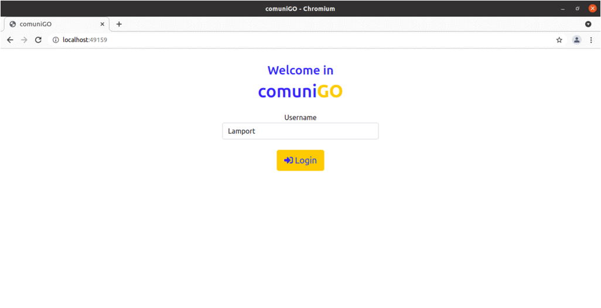

# comuniGO

**comuniGO** is a [gRPC](https://grpc.io/docs/languages/go/) based P2P application developed in [GO](https://golang.org/) that supports both totally and causally ordered message delivery.

In the figure below **L. Lamport**, one of the main actors in _Distribuited Systems_ field, **S. Hykes**, a co-founder of Docker.inc, and **K. Thompson**, a co-designer of GO programming language, communicate with each other using **comuniGO**



## Building of components
The application is based on three different components:
1. The **peer** with whom you can interact via the web and internally uses gRPC to exchange messages with others
2. The **registration** service with which you can sign yourself and receive the peer list
3. The **sequencer** service necessary to implement the centralized totally ordered algorithm

So, thanks to the [builder script](build/builder.bash) it is possible to discriminate in fine grain what to build, in particular:
- To build **peer** you can `cd` into `build` folder and run:
```
bash builder -p
```
- To build **sequencer** you can `cd` into `build` folder and run:
```
bash builder -s
```
- - To build **registration** service you can `cd` into `build` folder and run:
```
bash builder -r
```

## Installation and configuration
Before building and running the application, you can edit the [configuration file](build/comunigo.cfg) to specify some environment configuration settings.

After that you can use 

Within a particular ecosystem, there may be a common way of installing things, such as using Yarn, NuGet, or Homebrew. However, consider the possibility that whoever is reading your README is a novice and would like more guidance. Listing specific steps helps remove ambiguity and gets people to using your project as quickly as possible. If it only runs in a specific context like a particular programming language version or operating system or has dependencies that have to be installed manually, also add a Requirements subsection.

## Testing

## Usage
Use examples liberally, and show the expected output if you can. It's helpful to have inline the smallest example of usage that you can demonstrate, while providing links to more sophisticated examples if they are too long to reasonably include in the README.